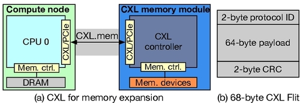
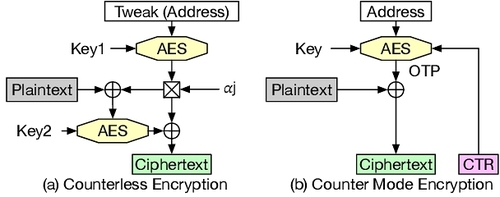
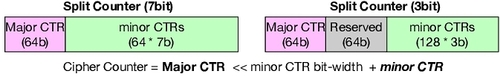
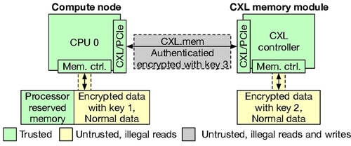
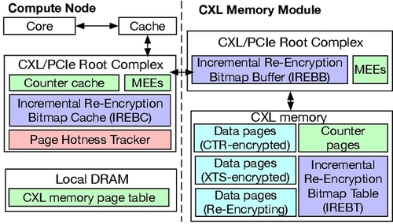
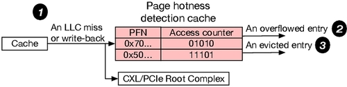
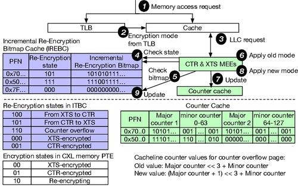
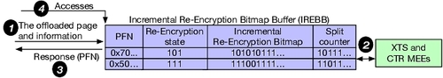
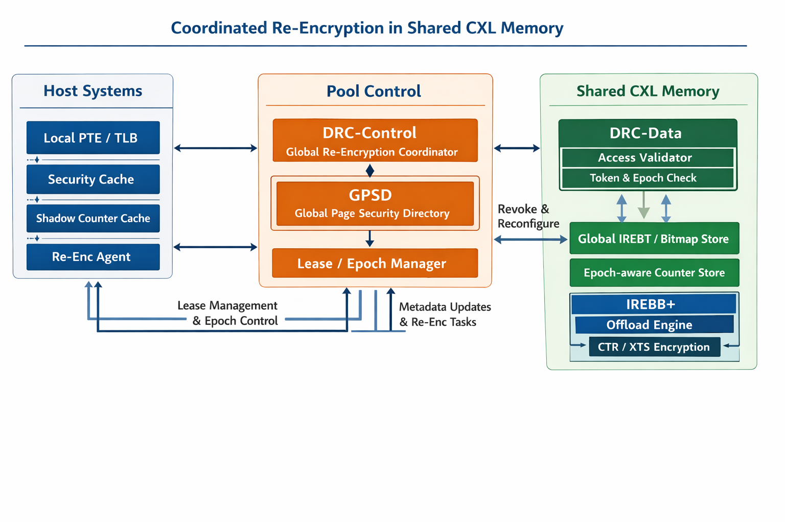

# Efficient Security Support for CXL Memory through Adaptive Incremental Offloaded (Re-)Encryption

> [DOI 链接](https://doi.org/10.1145/3725843.3756119)

## 一句话总结

这篇论文针对 **CXL memory 在 TEE 场景下的高安全开销**问题，提出了 **AIORE**：按页在 **XTS** 与 **CTR** 两种加密方式间自适应切换，并结合 **增量式重加密** 与 **内存侧卸载重加密**，在保证安全属性的同时显著降低了 secure CXL 的性能损失。

## 这篇论文在解决什么问题？

随着 DRAM 扩展越来越困难，CXL 被视为提升内存容量和带宽的重要方向。问题在于：

- CXL memory 会把内存扩展到 **CPU 之外的设备/节点**；
- 公有云环境里又必须考虑 **机密性、完整性、重放保护、链路攻击**；
- 现有方案通常把 **TEE 内存加密** 和 **CXL IDE 链路加密**叠加使用；
- 但这种“安全全开”的代价很高，尤其是在 **memory-intensive workloads** 上。

论文的核心观察是：

> 现有 secure CXL 的主要瓶颈不只是“要不要加密”，而是**哪种加密适合哪类页，以及切换/重加密怎么做才不把系统拖垮**。

作者重点针对一种主流基线：

- 主机侧使用 **XTS-based TEE** 保护内存内容；
- CXL 链路使用 **CXL IDE（AES-GCM）** 保护传输；

虽然安全属性完整，但 **XTS 解密在读路径上延迟很高**，对 CXL 这种本来就更远的内存尤为敏感。

## 论文主要贡献

- 从安全性和性能的角度对保护 CXL 内存的潜在解决方案进行了系统分析
- 引入了自适应增量卸载（重新）加密（AIORE），它有效地将 CTR 和 XTS 加密与内存节点计算能力相结合，以提高安全 CXL 内存的效率
- 对 AIORE 的实现和评估表明，与不安全的 CXL 相比，它平均只产生 3.7% 的开销，从而提供了高效的 CXL 安全支持
## 背景：为什么 secure CXL 会慢？

论文把问题拆成两层：

### 1. CXL 链路层安全：CXL IDE

CXL IDE 用 **AES-GCM** 在 Flit 级别提供：

- 机密性
- 完整性
- 唯一性
- 重放保护

这解决的是 **CPU ↔ CXL 设备链路被窃听/篡改/重放** 的问题。

使用 256 位伽罗瓦计数器模式 AES (AES-GCM) 在 Flit 级别确保机密性、完整性、唯一性和重放保护。AES-GCM 使用初始化向量 (IV)、计数器和加密密钥生成一次性密码本 (OTP)，然后将其与明文进行异或运算，生成第一个 256 位密文段。计数器通过发送方和接收方之间安全共享的公式递增或计算，随后使用该同步计数器对第二个段进行加密。 MAC 使用从主加密密钥派生的哈希子密钥生成，涉及伽罗瓦域乘法和与密文进行异或运算等操作。由于 OTP 以同步计数器作为输入，因此它也能保证消息的唯一性，这意味着传输相同的 Flit 将生成不同的密文。此外，由于 OTP 与地址无关，因此可以使用 GCM OTP 预计算来最大程度地隐藏 GCM 加密/解密延迟。

### 2. 内存内容安全：TEE memory encryption

现有 TEE 常见有两类：

- **XTS / counterless encryption**
- **CTR / counter mode encryption**

论文还提到了Split Counter，这是一种基于CTR的优化，分离式计数器方案使用一个大的主计数器和一系列次计数器，使得一个页面中 64 个缓存行对应的 64 个计数器可以容纳在一个 64 字节的缓存行中，从而减少了计数器所需的空间。通常，这包括 7 位和 3 位的次计数器，如图所示。AES 加密的计数器值是通过将共享的主计数器与私有的次计数器结合而得出的，公式为：主计数器 ≪ 次计数器位宽 + 次计数器值。当次计数器溢出时，主计数器会递增，这需要使用新的主计数器重新加密关联的页面。此过程涉及读取、解密、重新加密和写回所有共享该主计数器的缓存行，从而显著降低系统性能。由于次计数器的位宽有限，因此与整体计数器相比，它们更容易发生溢出。

TEE之间的性能特点不同：

#### XTS 的优点
- 不需要 per-line counter metadata
- 结构简单

#### XTS 的缺点
- 读请求返回后还要做 XTS 解密
- 解密延迟在关键路径上，很难完全隐藏

#### CTR 的优点
- 如果 counter cache hit，可以**并行生成 OTP**，数据一到就 XOR 得到明文
- 命中时延迟很接近 insecure case

#### CTR 的缺点
- 依赖 counter cache
- miss 时要额外取 counter，带来更多带宽和延迟
- 如果使用 split counter，又会带来 counter overflow 和 page re-encryption 的开销

论文的出发点正是：

> **XTS 稳，但慢；CTR 快，但并不是所有页都适合。**

所以与其全局只选一种，不如按页自适应。

## 基线和威胁模型

### 1. Baseline

采用 XTS TEE 并集成 CXL IDE 的最新基线方案。主机 CPU 使用 XTS TEE 和密钥 1 对其本地内存进行加密。类似地，CXL 模块使用密钥 2 对 CXL 内存进行加密。主机 CPU 和 CXL 模块之间通过 TEE IO 和 TEE TDISP 实现的密钥交换，使得 CPU 可以直接解密使用密钥 2 加密的密文。所有沿 CXL 链路传输的消息均使用密钥 3 进行保护，这涉及到在 CXL/PCIe 组件的根复合体中执行的加密和认证过程。

### 2. Threat Model

采用 XTS TEE 和 CXL IDE 的威胁模型。该系统的可信计算基 (TCB) 包括处理器、内存控制器、CXL 控制器、CXL/PCIe 组件、隔离区虚拟机 (VM) 和处理器保留内存，而所有其他硬件（例如，片外内存）和软件（例如，操作系统和虚拟机管理程序）均被视为不可信。威胁场景包括攻击者完全控制特权软件，旨在破坏数据的机密性和完整性；以及对系统的物理访问，这使得攻击者能够在 CPU-内存总线上窥探数据，但无法修改传输的数据。

对于 CXL 链路，攻击者可以拦截、篡改和重放过时的数据值。虽然侧信道攻击 、CPU 漏洞和拒绝服务攻击也很重要，但它们超出了威胁模型的范围。

## 核心思路：AIORE 到底是什么？

AIORE = **Adaptive Incremental Offloaded (Re-)Encryption**

AIORE 引入了页面热度跟踪器，用于根据 LLC 未命中和写回情况动态评估页面访问，并确定页面应使用 XTS 还是 CTR 加密。为了支持增量式和卸载式重加密，计算节点的根复合体中集成了增量式重加密位图缓存 (IREBC)，而 CXL 内存模块的根复合体中则添加了增量式重加密位图缓冲区 (IREBB)，从而实现了增量式卸载页面重加密。此外，内存加密引擎 (MEE) 在基线版本中固有地支持 XTS 和 GCM 加密。还额外集成了对 CTR 加密的支持。

作者提出了三件配套设计：

### 1. Per-page adaptive encryption

当 LLC miss / write-back 到来时，tracker 中对应 PFN 的计数加 1；
若计数达到 hotness threshold，且页当前是 XTS，则触发 XTS → CTR；
若该 tracker 项被驱逐时，其计数低于 coldness threshold，且页当前不是 XTS，则触发 → XTS。

对每个 page 动态选择：

- **XTS**：适合低复用/冷页
- **CTR**：适合高访问频率/热页

这样做的原因是：

- 对热页，CTR 更容易从 counter cache hit 中获益；
- 对冷页，如果也上 CTR，它们的 counters 反而会污染 counter cache；
- 冷页明明复用不高，却要承担 counter metadata 成本，得不偿失。

也就是说，AIORE 的第一个关键点不是“发明一种新加密算法”，而是：

> **把页面访问热度纳入加密模式选择。**

这是很有 systems 味道的设计：不在算法层死磕，而是在机制层把不同工作负载特征分流。

### 2. Incremental re-encryption

IREBC 条目包含：
- 36-bit PFN
- 3-bit re-encryption state (这个3-bit比起PTE中的2-bit能更具体的表述状态，如counter overflow/from XTS to CTR/from CTR to XTS)
- 若页处于重加密中，再加一个 64-bit bitmap (对应页内 64 条 cacheline，表示该条 cacheline 是否已经完成“切到新模式/新计数器”的转换)

仅仅支持“页模式切换”还不够，因为：

- XTS ↔ CTR 切换需要重加密；
- split counter overflow 也可能触发整页重加密；

如果每次都停下来整页读出、解密、再加密、写回，代价很大。

因此作者提出 **incremental re-encryption**：

- 不一次性粗暴重加密整个页；
- 而是把重加密工作和**程序本来就会发生的访问**结合起来；
- 在正常数据访问与加解密流程中，逐步完成该页转换。

核心思想是：

> **把本来必须发生的访问利用起来，顺手完成重加密。**

这能显著降低模式切换和 counter overflow 带来的突发开销。

### 3. Offloaded re-encryption

但仍有一种情况：

- 某页只被访问了一部分 cachelines；
- 剩余 cachelines 长时间不再被程序触碰；
- 这样 incremental re-encryption 会“卡尾巴”。

所以 AIORE 进一步把剩余的 re-encryption **卸载到 memory node**：

- 当某页在一段时间内未完成重加密；
- 由 CXL memory 侧计算单元完成剩余部分；
- 减少 host 额外参与和链路往返。

这一步非常关键，因为它把“安全维护成本”从 host 关键路径中继续剥离出去。

## 论文的技术判断为什么成立？

这篇最好的地方，是它没有简单喊一句“CTR 比 XTS 快”，而是认真分析了 **什么时候快，什么时候反而会变慢**。

论文指出了两个典型 inefficiency：

### inefficiency 1：CTR 不适合所有页

如果所有页都采用 CTR：

- 热页和冷页都要占用 counter cache；
- 冷页 counter 复用很低；
- 它们会污染 cache，伤害真正该受益的热页。

### inefficiency 2：split counter 虽然省空间，但 overflow 很贵

使用更紧凑的 split counter：

- 能提升 counter cache hit rate；
- 但 minor counter 更容易 overflow；
- overflow 后整页重加密会非常贵，尤其在 CXL memory 环境下更贵。

所以 AIORE 的真正贡献不是“CTR + XTS 混合”这么简单，而是：

> **把 page hotness、counter cache pressure、re-encryption cost、memory-node compute 这几件事统一到一个机制里。**

## 安全性上做了什么保证？

论文的 baseline threat model 大体延续现有 TEE + CXL IDE 体系：

- 可信部分包括 CPU、memory controller、CXL controller 等 TCB；
- 不可信部分包括 off-chip memory、OS、hypervisor；
- 还考虑物理窃听、篡改、重放等链路攻击；
- side-channel、DoS、CPU bugs 不在本文范围内。

作者比较了多种设计的安全/性能权衡：

- **XTS TEE + CXL IDE**：安全完整，但性能较差；
- **CTR TEE + CXL IDE**：在 counter hit 时更快；
- **CTR + integrity tree**：有不同的安全/性能特点，但不完全等价于当前基线；
- **AIORE**：希望在维持所需安全属性下逼近 insecure performance。

从论文表述看，AIORE 不是牺牲安全换性能，而是通过：

- 按页选择加密模式
- 更低代价完成模式切换/重加密
- 减少 host 关键路径上的冗余工作

来获得性能收益。

## 评估方法与结果

作者在 **Gem5** 上实现并评估 AIORE，和 **7 个 baselines** 比较，工作负载来自：

- SPEC2017
- SPEC2006
- 图计算应用

### 论文给出的主要结果

- 相比各类安全基线，AIORE 平均减少 **62.8%** 的 security overhead
- 相比 insecure CXL：
  - 单核平均开销约 **3.2%**
  - 多核平均开销约 **4.3%**
- 摘要和正文中也强调其总体 overhead 大致可控制在 **3%~4%** 量级

这是一个相当强的结果，因为它意味着：

> secure CXL 不再是“安全一开，性能明显掉一截”，而是可以逼近不加密时的表现。

## 最重要的贡献

这篇论文的价值在于：

> 它把“secure CXL 性能差”的问题，从单一的密码学延迟问题，重新建模成了一个**页级冷热性驱动的体系结构优化问题**。

更具体一点，有三个层面的贡献：

### 1. 重新定义了优化对象

不是只优化某一次加密，而是优化：

- 哪些页值得用 CTR
- 哪些页继续留在 XTS
- 切换代价如何被平摊
- 剩余维护工作如何卸载到 memory node

### 2. 体现了 CXL 时代 memory-side compute 的价值

这篇论文不是把 memory node 当被动设备，而是当成一个可以承担系统维护工作的参与者。

这和传统“CPU 主导一切”的思路不同，很符合 CXL / disaggregated memory 未来的发展方向。

### 3. 证明 secure disaggregated memory 不一定天然高开销

过去大家常默认：

- 内存一旦跨节点/跨链路
- 又叠加完整安全机制
- 性能肯定会非常难看

AIORE 的结果表明这并非必然，只要机制设计合理，secure CXL 可以接近 insecure baseline。

## 局限与可能问题

### 1. 依赖访问模式稳定性

AIORE 的收益来自“按页冷热性做选择”。

如果一个 workload：

- 相位变化特别快；
- 页面冷热频繁翻转；
- 访问行为高度不稳定；

那么模式切换判断是否还能稳定获益，需要更仔细验证。

### 2. 增量重加密与卸载重加密引入了更复杂的状态机

相比传统单一加密模式，AIORE 明显更复杂：

- 页当前使用什么模式
- 重加密进行到哪一步
- 哪些 lines 已切换，哪些未切换
- 何时由 host 完成，何时交给 memory node

这种复杂性在真实硬件中会带来：

- 更高设计验证成本
- corner case 处理难度增加
- 故障恢复/一致性维护更麻烦

### 3. Gem5 结果与真实硬件之间仍有落差

这是 architecture 论文常见问题，不是这篇独有的缺点。

但对 CXL 而言，真实部署时还会叠加：

- 控制器实现细节
- 链路拥塞
- NUMA 行为
- 固件/驱动软件栈
- 多租户云环境干扰

这些可能影响最终收益。

### 4. 安全边界仍继承自现有 TEE/CXL IDE 假设

本文并没有试图解决：

- side-channel
- DoS
- 更强对手模型下的攻击

所以它更准确的定位是：

> **在既有 TEE + CXL IDE 安全框架内，提高 secure CXL 的效率。**

而不是重新定义 secure memory 的全部安全边界。

## 和相关工作的关系

这篇论文和已有工作最关键的差异在于两点：

### 它不是单纯比较 XTS 与 CTR

很多工作会问：
- XTS 好还是 CTR 好？

这篇的答案是：
- **看页的访问行为，不能一刀切。**

### 它不是只优化 counter structure

很多 memory encryption 论文会重点优化：
- counter cache
- integrity tree
- split counter layout

AIORE 更进一步，把：
- encryption mode selection
- re-encryption scheduling
- memory-side offload

一起纳入设计。

## 启发

### 启发 1：性能瓶颈常常来自“机制交界面”

AIORE 优化的不是单个模块，而是：

- TEE memory encryption
- CXL link security
- counter metadata
- page migration / re-encryption

这些机制交会的地方。

### 启发 2：冷热分化是 systems 优化的常见抓手

“热页/冷页不同处理”其实是系统设计中非常有生命力的套路。

AIORE 把它用到 secure CXL 上，效果很好。

### 启发 3：offload 不只是把计算移走，而是把关键路径缩短

真正重要的不是“工作移到 memory node”，而是：

- host 关键路径上少做了什么
- 链路往返减少了什么
- 程序感知延迟下降了什么

## 适合继续追的问题

如果沿着这篇继续做研究，应该关注：

1. **更动态的页分类策略**
   - 是否能更细粒度、更低开销地做在线冷热判断？

2. **和 page placement / migration 联合优化**
   - 安全模式选择能否与 CXL page placement 一起做？

3. **多租户与 QoS 场景**
   - 多 VM / 多 tenant 共享 CXL memory 时是否仍稳定？

4. **与完整性树/新型 metadata 组织结合**
   - 是否还能进一步减少 metadata traffic？

5. **真实硬件原型验证**
   - 尤其是 memory-side offload 的工程成本与收益比

## 下一步想做的

AIORE 的状态组织天然是单主机模型：

 - PTE 状态由一个 host 的页表维护
 - IREBC 在一个 host 侧
 - counter cache 也在一个 host 侧
 - offload 只是 host 和 device 之间的两方关系

但 CXL 这两年正在明显走向 memory pooling / shared memory / multi-host。

### Distributed Re-encryption Coordination for Shared CXL Memory (面向共享 CXL 内存的分布式重加密协调机制)

解决的问题是当一页远端 CXL 内存被多个 host 共享、迁移、撤销、重新授权时，谁来当这页安全状态的权威，谁来推进重加密，谁来回收旧权限，以及怎样保证所有 host 看到的是同一个安全版本。

把“谁说了算”从 host 挪到共享内存设备侧

最稳妥的做法不是让 Host A、Host B 互相同步 IREBC，而是：把共享页的安全主状态做成 device-authoritative。

也就是由共享 CXL Type-3 memory pool 内部的一个控制器，维护该页的“权威版本”；各 host 只缓存影子状态。

---

AIORE 原文解决的是单个主机访问 CXL 内存时的自适应 CTR/XTS、增量重加密和设备端 offload。CXL 3.x 则已经把 memory pooling、memory sharing、fabric manager 等能力放进了规范方向里，而 PIPM 和 Space-Control 说明“多主机共享远端 CXL 内存”和“共享场景需要更强安全控制”都已经是明确问题。

把整个架构理解成三层：

**第一层是 Host side 的快速访问层，第二层是 Pool side 的全局控制层，第三层是 Memory datapath side 的最终执行与验证层。**
这样分的核心思想是：**host 只持有软状态和加速状态，真正的权威状态放在共享内存池一侧，真正的最终放行检查放在内存数据路径一侧。** 这既继承了 AIORE 把关键重加密元数据放在 memory node 附近的思路，也符合共享 CXL 内存需要 pool-centric authority 的方向。

---

## 一、Host side：负责“快”，但不负责“最终说了算”

### 1. Local PTE/TLB shadow

它的作用不是存全部安全真相，而是让 host 在**正常读写的快路径**上，先知道这页大致是什么状态，比如稳定态是 CTR 还是 XTS、当前本地缓存的 epoch 是多少。AIORE 里就已经把页级 encryption state 放进 PTE/TLB，用于普通 miss 的快速判断；共享版里这层仍然需要保留，否则每次访问都要远程查全局目录，延迟会非常高。

它为什么只能是 shadow？
因为一旦共享，同一页可能同时被多个 host 映射。此时如果每个 host 的 PTE 状态都当真，那就会出现“Host A 觉得页已进入新 epoch，Host B 还拿旧状态访问”的冲突。所以本地 PTE/TLB 只能看作**缓存出来的快照**，不能看作权威。这个判断是对共享场景的架构推演，但它正是 Space-Control 之类工作为什么把最终验证放到共享内存硬件路径上的原因。

### 2. Local Security Cache

新增的小 cache。它缓存的不是普通地址翻译信息，而是共享页最近的安全摘要，比如：

* 当前 `epoch`
* 本 host 的 `lease type`（读共享还是写独占）
* 稳定态 `enc_mode`
* 是否 `transient`
* bitmap 摘要或版本号

它的价值在于把“共享安全状态”的常见查询挡在 host 本地，避免每次访问都去碰 GPSD。它在角色上很像 Space-Control 用来摊销每次访问权限检查开销的那种小缓存；也像 AIORE 里 IREBC 对过渡页状态做的主机侧加速，但这里缓存的是**共享安全目录的影子**。

没有它会怎样？
共享内存每次访问都去查 pool side 的全局目录，系统会变成“安全正确，但慢得不能用”。

### 3. Shadow Counter Cache

AIORE 中 counter cache 非常关键，因为 CTR 模式要靠计数器加速解密，并且 overflow 会触发特殊的重加密路径。共享版里建议保留 host 侧 counter cache，但把它改成 **epoch-tagged shadow**：
**host 可以缓存 counter，但不能拥有 counter 的最终版本权。** AIORE 已经说明了 counter、minor overflow、incremental re-encryption 是核心状态机的一部分；共享版的区别只是把“最终版本”挪到 pool side。

它的作用是快；它的限制是不能单独决定正确性。
否则两个 host 各自推进同一页的 counter 演进，最后一定打架。

### 4. Re-enc Agent

这是 host 侧真正执行“局部安全动作”的代理。它负责：

* 申请 lease
* 接收 revoke
* 提交本地 dirty 状态
* 在被指定为 leader 时推进 host-side incremental re-encryption
* 把 bitmap/counter 差分提交给 pool side

AIORE 已经有 host 侧参与增量重加密的逻辑；共享版里 Re-enc Agent 的新职责，是**把本地主机变成协议参与者，而不是权威状态持有者**。

---

## 二、Pool control side：负责“谁说了算”

这是整个设计最关键的地方。
**DRC 真正应该落在这里。**

### 5. DRC-Control

它是全局控制平面，位置应该在 **memory pool controller / fabric-side pool controller**，而不是某个 host。CXL 3.0/3.x 的 pooling、sharing 和 fabric manager 方向，本质上都在强调：共享资源的协调点应该靠近 fabric/pool，而不是绑定单个主机。

它的核心功能有四个：

**第一，state authority。**
它决定“某页当前安全状态的最终真相是什么”。这意味着任何 host 的本地缓存状态，只要和 DRC-Control 冲突，都以 DRC-Control 为准。

**第二，lease 管理。**
谁可读、谁可写、写独占是否已生效、哪些 sharer 还没退出，这些都应由它统一裁决。

**第三，epoch 推进。**
当发生 writer handoff、跨信任域共享、revoke、或某些 overflow/rekey 事件时，它决定是否 `epoch++`。一旦 epoch 变化，旧 token、旧 shadow counter、旧本地安全缓存都自动失效。

**第四，leader 选择。**
共享页在任一时刻，只允许一个 leader 推进重加密。这个 leader 可以是某个 host，也可以是 device-side offload engine，但不能同时有两个。这个点是从 AIORE 单主机“天然单 leader”的状态机延伸出来的：共享场景必须把这个隐含前提显式化。

### 6. GPSD：Global Page Security Directory

这是 DRC-Control 背后的核心数据结构，也是最应该强调的结构。

它记录每个共享页的全局安全状态，例如：

* `page_id`
* `stable enc_mode`
* `transient_state`
* `epoch`
* `leader_host / leader_type`
* `lease_state`
* `sharer_set`
* `revoke_pending_set`
* `bitmap_ptr`
* `counter_ptr`
* `offload_owner`

它的功能不是做普通页表，而是做**共享页的安全目录**。
为什么必须有它？因为 AIORE 里的关键状态原本分散在 PTE、IREBC、IREBT、counter cache 中，而这些东西在单主机场景下天然可以由一个 host 串起来；共享场景里，如果没有一个统一目录，就没法回答“哪个状态才是最新的”。

可以把 GPSD 理解成：
**共享页的“安全版目录控制器”。**

### 7. Lease / Epoch Manager

这其实可以视为 DRC-Control 的子模块，值得单独讲。

它把两件事分开：

* **Lease**：逻辑访问权限
* **Epoch**：密码学/安全版本

这样设计的好处非常大。
因为撤销并不总是意味着“立刻整页重加密”。很多时候可以先：

1. 收回旧 host 的 lease
2. 让其缓存状态失效
3. 只有在 crossing trust boundary 或 writer handoff 等关键点，才 bump epoch

这样可以把“逻辑访问控制”和“密码学更新成本”解耦。Space-Control 关注的是每次访问的权限检查；这篇工作的扩展点就在于，把权限变化和安全版本演进绑进同一个协议。

---

## 三、Memory datapath side：负责“最后一跳必须正确”

### 8. DRC-Data

这是 DRC 的数据面，位置应该在 **shared Type-3 memory device controller** 内部或其旁边。
它不是大脑，而是**最后执法者**。

为什么要有它？
因为即使 DRC-Control 已经决定“Host C 被撤销了”，Host C 仍可能拿着旧 token、旧 TLB、旧本地缓存发请求。这个时候，真正能阻止它的，不是远端软件，而是内存数据路径上的硬件检查。Space-Control 的核心也是“对每次访问做硬件强制验证”。

它负责的事情包括：

* 校验请求携带的 `lease token`
* 校验 `epoch`
* 判断是否 stale access
* 若页处于 transient，决定该请求该被阻塞、放行还是重定向到更细的状态查询
* 在 offload 完成时切换最终状态

### 9. Access Validator

这是 DRC-Data 中最直接的安全门禁。

它检查至少三件事：

* 请求来自哪个 host / 上下文
* 该 host 当前是否在 `sharer_set` 或拥有 `write lease`
* 请求携带的 `epoch` 是否与 GPSD 一致

这个模块非常重要，因为它让“撤销”变成真的。
没有它，revoke 只是控制面的口头通知；有了它，revoke 才变成设备侧强制执行的硬规则。Space-Control 已经公开证明，共享 CXL 内存中把访问控制检查放到硬件路径里是可行的，而且开销可以很低。([arXiv][2])

---

## 四、共享安全元数据存储：负责“状态能落地，也能恢复”

### 10. Global IREBT / Bitmap Store

AIORE 里 IREBT 是设备端的 bitmap table/backing store，用来保存增量重加密的进度。共享版里它仍然必须存在，但要变成**全局共享版**：
任何 leader 无论是 Host A 还是 device-side offload，都不能只靠本地私有 bitmap；最终进度必须汇聚到 Global IREBT。

它的作用是：

* 记录页内哪些 line/sub-block 已切到新状态
* 支持 leader 切换时恢复进度
* 支持 host-side 和 device-side 之间交接 unfinished re-encryption

如果没有它，就会出现：Host A 做到一半，Host B 接手时根本不知道哪些 line 已完成。

### 11. Epoch-aware Counter Store

这个模块是共享版真正区别于 AIORE 的关键之一。

AIORE 里 counter 本质上还是单机状态机的一部分；共享版里建议把它设计成：

* counter 与 `epoch` 绑定
* host 上的 counter cache 都只是 shadow
* 只有 pool side 的 counter store 是 authoritative

它的作用有两个：

第一，保证多 host 不会各自演进 counter。
第二，把“撤销”和“旧密钥/旧计数器失效”统一到 epoch 机制里。

没有它，就算权限撤销成功，旧 host 仍可能用旧 counter 语义访问数据。

### 12. IREBB+：Device Offload Queue

AIORE 已经证明，设备端 IREBB 很适合接手那些 host 上没做完的长尾重加密任务。共享版里它更重要，因为它不仅处理“host 来不及做完”的情况，还处理：

* writer handoff 时的中间态
* leader 从 host 切到 device 的交接
* revoke 期间的清尾
* overflow 期间的全局一致性收尾

建议把它升级成 IREBB+：

**不仅是 offload buffer，还是共享页重加密的设备侧执行队列。**

### 13. CTR/XTS Engines

这一层其实可以直接继承 AIORE。
共享版不一定需要发明新加密模式；真正新的点在于**谁来协调、谁来更新状态、谁来保证一致性**。AIORE 已经说明 CTR/XTS 混合、overflow 重加密、设备端 offload 是合理的底层机制，所以这里最稳妥的是继承，而不是重造。

---

## 五、这套架构里最关键的四条工作流

### 1. 普通共享读

Host A 要读一个共享页时：

1. 先查本地 TLB / Local Security Cache
2. 若 lease 有效、epoch 匹配、页是稳定态，则直接访问
3. 若本地状态过期或页是 transient，则回源 GPSD/DRC-Data
4. DRC-Data 进行最终 token/epoch 校验后放行

这条路径的目的，是让**常见访问快，异常访问严格**。这和 AIORE “普通页快路径 + 过渡页慢路径”是同一哲学。

### 2. Writer handoff

Host B 想从现有 sharers 手中拿到写权限：

1. DRC-Control 发送 revoke 给旧 sharers
2. 等待 invalidate/flush ack
3. 视策略决定是否 `epoch++`
4. 把 Host B 设为新 writer 和/或新 re-encryption leader
5. 更新 GPSD 和 token

这一流程的作用，是把“谁可写”与“谁推进安全状态”统一。
它直接补上了 AIORE 在共享场景下没有回答的问题。

### 3. Revoke

真正完整的 revoke 应分三层：

* **逻辑撤销**：从 sharer set 中删掉该 host
* **缓存撤销**：失效其 TLB/PTE/local security cache/shadow counter
* **密码学撤销**：必要时 `epoch++`，让旧 token 和旧安全上下文失效

这套三层 revoke，把“访问控制”真正升级成“安全状态撤销”。Space-Control 已经证明硬件强制访问检查是必要的；扩展点在于再往前一步，把 re-encryption 和 revoke 合成一条协议。

### 4. Counter overflow / unfinished re-encryption

共享页发生 counter overflow 或模式切换时：

1. 某 host 只能发起 proposal，不能私自认定自己说了算
2. DRC-Control 把页状态置为 transient
3. 指定当前 leader
4. 进度写入 Global IREBT
5. 如 host 中途退出或 lease 切换，则任务转入 IREBB+
6. 完成后统一提交新 epoch/new counter state

这一步的作用，是把单机里的“本地重加密事件”升级成共享系统里的“全局安全状态变更事件”。这就是这篇新论文和 AIORE 的最大分水岭。

---

